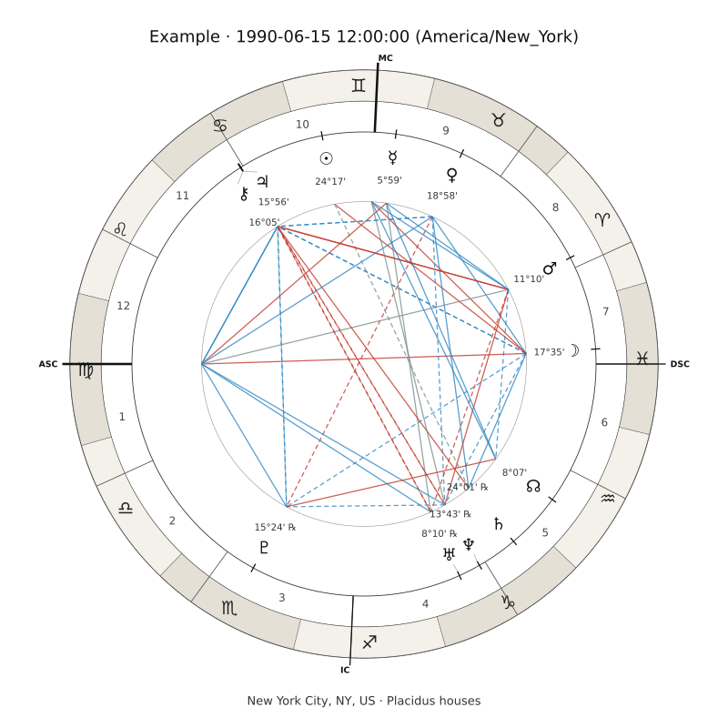

# chart-wheel

Draws a `chart.json` from the `natal-chart` skill as an SVG chart wheel: sign ring, house cusps and angles, planet glyphs with degree labels, and aspect lines coloured by family.

**Input:** any `chart.json` with `schema_version: 1`
**Output:** one self-contained 800×800 SVG, standard library only
**Convention:** Ascendant at 9 o'clock, zodiac and houses counter-clockwise

## Example output

The wheel for a chart cast for 1990-06-15 at 12:00 in New York City (Placidus, tropical, true node), drawn from [`natal-chart/examples/chart.json`](../natal-chart/examples/chart.json):



Red lines are oppositions and squares, blue are trines and sextiles, grey is the quincunx. Solid lines are applying, dashed are separating. Glyphs that had to be nudged apart carry a thin lead line back to their true position.

## Install

```bash
# Claude Code, project scope
cp -r chart-wheel .claude/skills/

# Claude Code, user scope
cp -r chart-wheel ~/.claude/skills/
```

Then ask Claude to "draw my chart" or "show me the wheel". It needs a `chart.json`, so install `natal-chart` alongside it; Claude will cast the chart first when there is none.

## Run the script directly

```bash
python scripts/chart_wheel.py chart.json --out wheel.svg
```

Requires Python 3.11 or newer and nothing else: no packages, no ephemeris files. The script reads the chart, never recomputes it. To get a PNG, rasterise the SVG with whatever is installed (`rsvg-convert -w 1600 wheel.svg -o wheel.png`, `cairosvg`, Inkscape).

## How it works

- `scripts/wheel_geometry.py` maps a zodiac longitude to a point on the canvas (the Ascendant pinned at 9 o'clock, angles increasing counter-clockwise) and spreads glyphs that sit within 6° of each other so they do not overlap.
- `scripts/chart_wheel.py` draws the rings in order: sign sectors, house cusps and the four angles, aspect chords on an inner circle, then the planet ticks, glyphs and labels on top. Captions outside the wheel carry the name, local time, place, house system and any flags.
- Aspect lines come straight from the chart's `aspects` list, so the wheel always matches the aspect grid; `applying: false` is drawn dashed.
- For an untimed chart (`meta.time_unknown`) there are no angles or houses, so 0° Aries is pinned at 9 o'clock, the house ring is skipped, and the caption says so.
- Radii, colours, glyphs and the font stack are constants at the top of `scripts/chart_wheel.py`. Fonts are named, not embedded; Chiron ⚷, the Node ☊ and ℞ depend on the viewer having a symbol font.

## Why it exists

A chart is easier to take in as a picture than as a table, and drawing one by hand is slow and inconsistent. Keeping the wheel in its own skill, reading only the documented `chart.json` contract, means the same code will draw solar returns, composites and other chart types when those skills arrive, without changing a line here.
